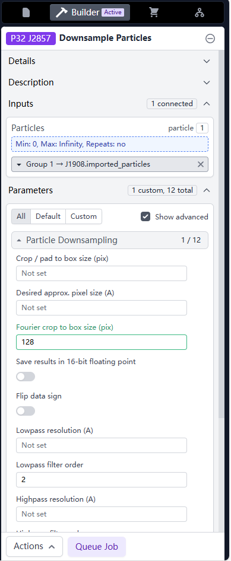
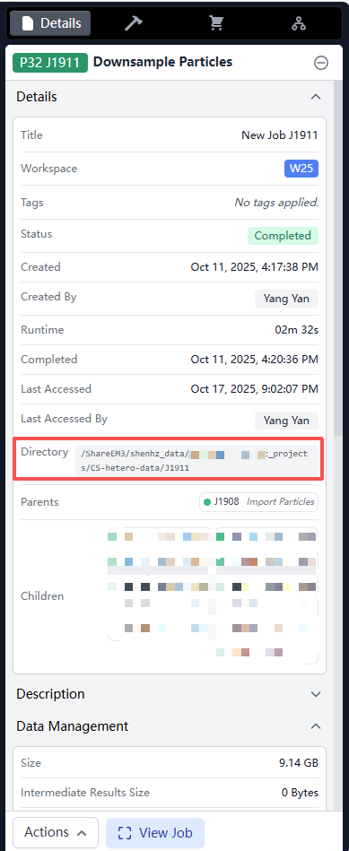

# Guide: Downsampling Particles in CryoSPARC

Downsampling particles to a box size of 128 pixels is highly recommended for CryoDECO to accelerate training and inference.

### Step-by-Step Instructions

1.  **Create Job:** In CryoSPARC, create a **Downsample Particles** job.
2.  **Input:** Drag and drop your particle stack into the `Particles` input slot.
3.  **Configure:** 
    *   Locate the parameter `Fourier crop to box size (pix)`.
    *   Set this value to **128**.
    
    

4.  **Run:** Queue and run the job.
5.  **Output:** Once complete, the output path of this job (e.g., `/your_cryoSPARC_project_path/JXX/`) can be used as the `--particles` input for CryoDECO.

    