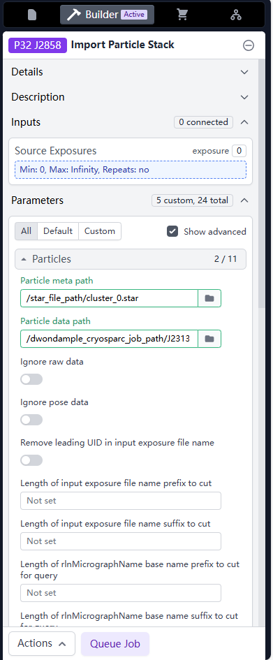
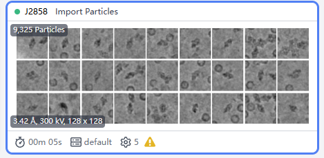
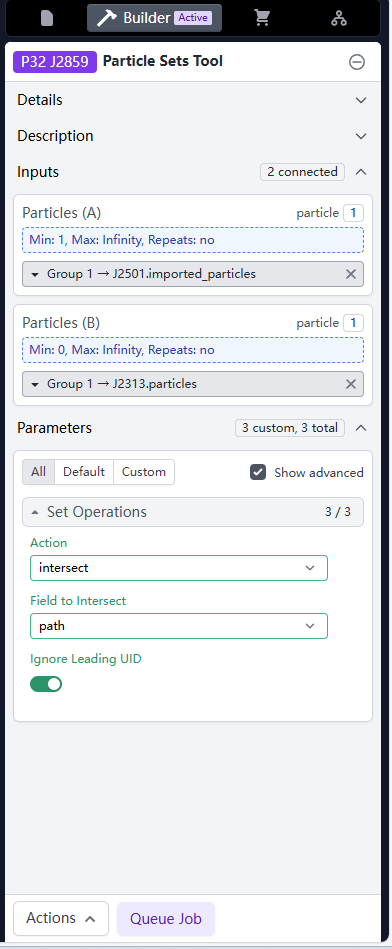
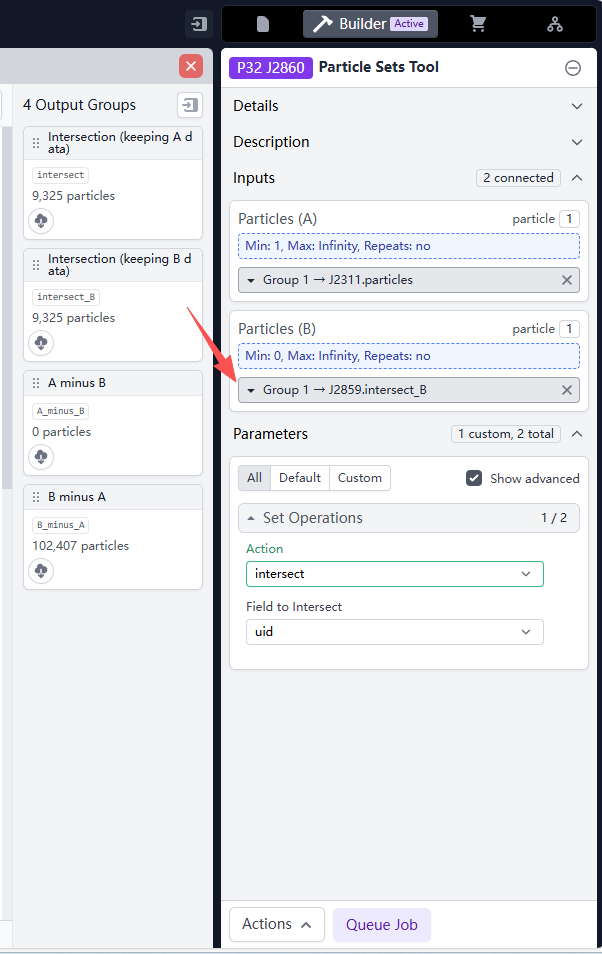
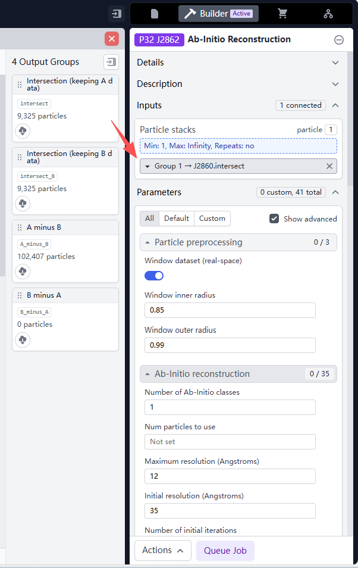
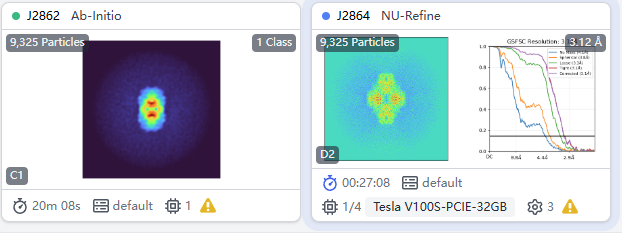

# Guide: Mapping Particles Back to Original Resolution

CryoDECO outputs `.star` files containing subsets of particles corresponding to identified clusters. If you ran CryoDECO on downsampled particles (e.g., 128px), you can map these subsets back to your original, high-resolution particle stack (e.g., 300px or 400px) to perform final high-resolution refinement in CryoSPARC.

### Prerequisites
*   **Original Job:** The original, high-resolution particle job (Input to your Downsample job).
*   **Downsample Job:** The downsampled particles.(same data as the input `--particles` of CryoDECO)
*   **CryoDECO Output:** The `.star` files located in `outdir/analysis_X/clustering_Y/clustering_cs_star/`.

### Step 1: Import CryoDECO Subsets
1.  Create an **Import Particles** job in CryoSPARC.
2.  **Particle meta path:** Path to the specific cluster `.star` file (e.g., `cluster_0.star`).
3.  **Particle data path:** Path to **Downsample Job**.
    *   *Note: If you did not downsample, input the path to **Original Job**. You can stop here and use these imported particles directly.*

    

    

### Step 2: Match UIDs (Intersection 1)
Because the imported `.star` files might not perfectly preserve CryoSPARC's internal paths, we first match the particles based on file paths to retrieve valid UIDs.

1.  Create a **Particle Sets Tool** job.
2.  **Particles (A):** The output from **Step 1** (Imported Cluster).
3.  **Particles (B):** The output of the **Downsample Job**.
4.  **Configuration:**
    *   **Action:** `Intersect`
    *   **Field to Intersect:** `path`
    *   **Ignore Leading UID:** `True` (Check this box).

    

### Step 3: Retrieve High-Res Data (Intersection 2)
Now that we have the correct UIDs from the original dataset, we can map them back to the high-resolution particles.

1.  Create a second **Particle Sets Tool** job.
2.  **Particles (A):** Path to the **Original Job** (high-resolution particles).
3.  **Particles (B):** The output `intersection (keeping B data)` from **Step 2**.
4.  **Configuration:**
    *   **Action:** `Intersect`
    *   **Field to Intersect:** `uid`
    *   **Output:** Ensure you are keeping data from **A**.

    

### Result
The output `Intersection (keeping A data)` now contains the high-resolution particles belonging to the specific cluster identified by CryoDECO. You may now proceed to **Ab-Initio Reconstruction** and **Non-Uniform Refinement** or further processing. Repeat this process for each cluster of interest.

